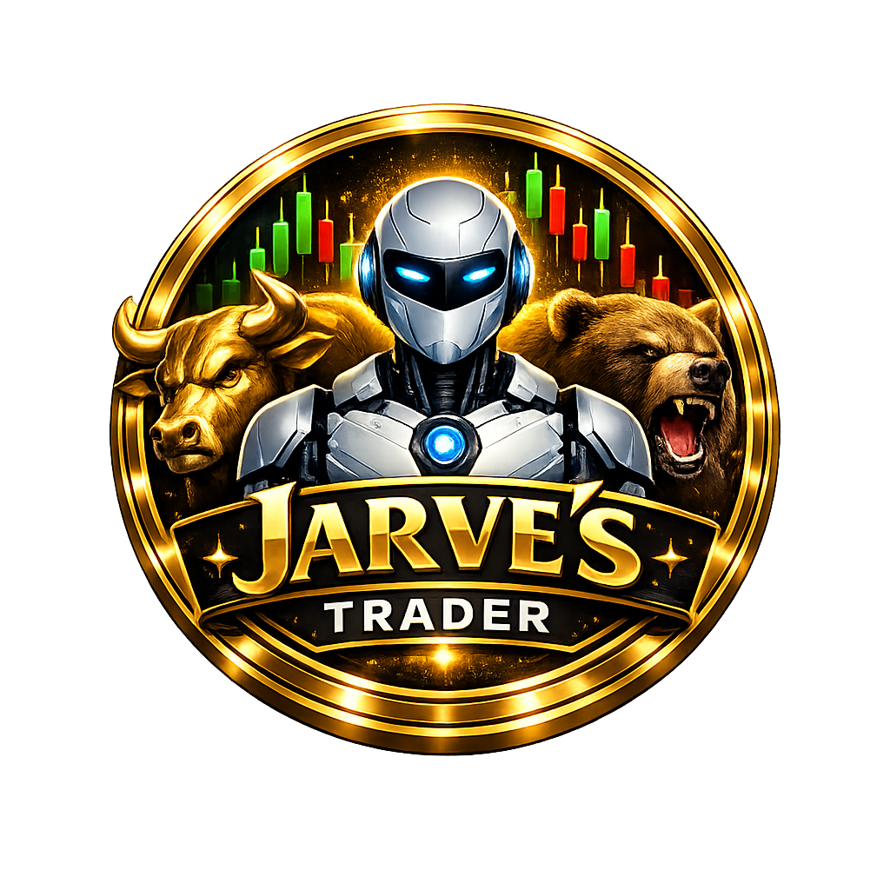

<div align="center">
# 🤖 Jarve's Trader - Expert Advisor para MetaTrader 5

**Sistema Automatizado de Trading com Machine Learning e Inteligência Artificial**

*"Tecnologia que entende o mercado, honestidade que valoriza seu capital"*



---


-red)


[](https://github.com/NatalSantiago/Jarves-Trader/releases/latest)
[](https://wa.me/5599984447141)
[](mailto:natal.santiago.tech@gmail.com)

</div>

---

## 🎯 O Que é o Jarve's Trader?

O **Jarve's Trader** é um Expert Advisor (robô de trading) de última geração desenvolvido exclusivamente para MetaTrader 5. Ele combina análise técnica tradicional com algoritmos avançados de Machine Learning para criar um sistema de trading completamente automatizado, adaptativo e inteligente.

### 🤔 Como Funciona?

O robô opera 24 horas por dia, analisando o mercado em tempo real através de múltiplas camadas de inteligência:

1. **Análise Técnica Avançada** - Monitora indicadores, padrões gráficos e tendências
2. **Machine Learning** - Aprende com dados históricos e identifica oportunidades invisíveis
3. **Gestão de Risco Inteligente** - Protege seu capital com sistemas automáticos
4. **Execução Automática** - Abre e fecha operações sem intervenção humana

---

## ✨ Recursos Principais do Sistema

### 🧠 Machine Learning Inteligente
O coração do sistema é seu módulo de Machine Learning que:
- **Aprende automaticamente** com dados históricos de mercado
- **Reconhece padrões complexos** que humanos não percebem
- **Prevê movimentos futuros** com base em padrões aprendidos
- **Ajusta-se automaticamente** a diferentes condições de mercado
- **Combina múltiplos algoritmos** para maior precisão

### 📊 Análise Técnica Completa
O robô analisa o mercado através de:
- **15 padrões de candlestick** diferentes (Hammer, Doji, Engulfing, etc.)
- **Múltiplos indicadores técnicos** simultaneamente (EMA, RSI, MACD, Bollinger)
- **Análise multi-timeframe** (M5 até D1 simultaneamente)
- **Volume e spread** para confirmar movimentos
- **Divergências** entre preço e indicadores

### 🛡️ Sistema de Gestão de Risco 4.0
Seu capital é protegido por 4 camadas:
1. **Prevenção** - Filtra operações arriscadas antes de entrar
2. **Proteção Individual** - Stop Loss e Take Profit inteligentes
3. **Gestão de Portfólio** - Controla exposição total da conta
4. **Proteção de Capital** - Para automaticamente em drawdowns extremos

### ⚡ Execução Automática
- **Entradas automáticas** quando condições são atendidas
- **Saídas inteligentes** com trailing stop dinâmico
- **Gerenciamento de posições** (scaling in/out)
- **Proteção contra slippage** e spreads altos
- **Re-tentativas** em caso de falhas de conexão

### 📰 Análise Fundamental Integrada
O robô considera:
- **Calendário econômico** em tempo real
- **Eventos de alto impacto** (Non-Farm, FED, etc.)
- **Horários de abertura/fechamento** de mercados
- **Feriados e fins de semana**

### 🌐 Interface Amigável
- **Totalmente em português**
- **Painel de controle visual**
- **Configuração por perfis** (conservador, moderado, agressivo)
- **Logs detalhados** de todas as operações
- **Alertas visuais e sonoros**

---

## 🧠 Sistema de Machine Learning Detalhado

### Como o Robô Aprende?

O sistema de aprendizado funciona em 4 etapas:

#### 1️⃣ Coleta de Dados
O robô coleta automaticamente:
- Dados históricos de preço (OHLC)
- Volume de negociação
- Indicadores técnicos calculados
- Padrões gráficos identificados
- Informações de mercado relevantes

#### 2️⃣ Preparação dos Dados
Os dados coletados são:
- Normalizados para mesma escala
- Balanceados para evitar viés
- Divididos em treino e teste
- Processados para remover ruído

#### 3️⃣ Treinamento dos Modelos
São utilizados 7 algoritmos diferentes:
- **Random Forest** - Para padrões complexos
- **Gradient Boosting** - Para tendências fortes
- **Support Vector Machines** - Para classificações precisas
- **Redes Neurais** - Para reconhecimento avançado
- **K-Nearest Neighbors** - Para similaridade de padrões
- **Naive Bayes** - Para probabilidades rápidas
- **Regressão Logística** - Para sinais binários

#### 4️⃣ Validação e Seleção
Cada modelo é testado através de:
- **Validação cruzada** (k-fold)
- **Testes com dados recentes**
- **Comparação de métricas** (accuracy, precisão, recall)
- **Seleção do melhor modelo** para cada ativo

### Interface de Treinamento

O robô inclui um **TreinadorML.mq5** que oferece:
- **Interface gráfica** para configurar treinamentos
- **Progresso em tempo real** com barras visuais
- **Seleção de algoritmos** com checkboxes
- **Configuração de parâmetros** detalhada
- **Relatórios automáticos** de performance

### Processo de Treinamento Passo a Passo

1. **Abrir o TreinadorML** no MetaTrader 5
2. **Selecionar o ativo** e timeframe desejado
3. **Escolher período histórico** para treinamento
4. **Selecionar algoritmos** a serem treinados
5. **Clicar em "Iniciar Treinamento"**
6. **Aguardar conclusão** (2-30 minutos dependendo da quantidade de dados)
7. **Modelo é salvo automaticamente** e integrado ao EA principal

### Reciclagem Automática

O sistema se mantém atualizado através de:
- **Re-treinos semanais** com dados mais recentes
- **Ajustes automáticos** quando performance cai
- **Treinamento incremental** sem perder conhecimento anterior
- **Detecção de mudanças** no comportamento do mercado

---

## ⚙️ Como o Robô Opera no Mercado

### Processo de Decisão

A cada novo candle, o robô executa:

#### 1. Análise do Mercado
- Verifica condições técnicas em múltiplos timeframes
- Calcula indicadores em tempo real
- Identifica padrões de candlestick
- Avalia volume e liquidez

#### 2. Consulta ao Modelo ML
- Extrai features do mercado atual
- Envia para o modelo ML treinado
- Recebe previsão de movimento
- Obtém score de confiança

#### 3. Avaliação de Risco
- Calcula tamanho de posição adequado
- Define Stop Loss e Take Profit
- Verifica exposição total da conta
- Confirma horários permitidos

#### 4. Execução da Operação
- Envia ordem com parâmetros calculados
- Monitora posição em tempo real
- Ajusta trailing stop conforme movimento
- Fecha posição quando alvo ou stop é atingido

### Estratégias Implementadas

#### 📈 Estratégia de Tendência
- Identifica tendências fortes com ML
- Entra na direção da tendência
- Usa trailing stop dinâmico
- Ideal para mercados trending

#### 📉 Estratégia de Reversão
- Detecta sobrecompra/sobrevenda com ML
- Antecipa reversões de preço
- Opera contra a tendência momentânea
- Excelente para mercados range-bound

#### ⚡ Estratégia de Breakout
- Identifica níveis de suporte/resistência
- Opera rompimentos confirmados
- Usa stops apertados
- Para mercados voláteis

#### 🤖 Estratégia Ensemble
- Combina todas as estratégias
- Usa votação ponderada entre modelos
- Maior robustez e consistência
- Recomendada para maioria dos traders

---

## 🛡️ Sistema de Gestão de Risco

### Proteção por Camadas

#### Camada 1: Prevenção (Antes da Operação)
- **Limite diário de trades** - Evita over-trading
- **Filtro de horários** - Não opera em momentos perigosos
- **Filtro de notícias** - Evita eventos de alto impacto
- **Spread máximo** - Não opera com spreads altos
- **Confiança mínima ML** - Só opera com alta probabilidade

#### Camada 2: Proteção Individual (Durante a Operação)
- **Stop Loss inteligente** - Baseado em ATR e volatilidade
- **Take Profit dinâmico** - Ajusta conforme confiança do ML
- **Trailing Stop adaptativo** - Segura lucros sem sair cedo demais
- **Break even automático** - Move SL para entrada quando lucrativo

#### Camada 3: Gestão de Portfólio (Conta Inteira)
- **Exposição máxima por ativo** - Não concentra riscos
- **Correlação entre posições** - Evita exposição correlacionada
- **Drawdown diário máximo** - Para trading se limite for atingido
- **Margem de segurança** - Mantém margem livre suficiente

#### Camada 4: Proteção de Capital (Emergência)
- **Stop total da conta** - Para tudo em drawdown extremo
- **Fechamento forçado** - Em condições de mercado anormais
- **Alerta ao trader** - Notifica sobre situações críticas
- **Backup automático** - Salva configurações e histórico

### Cálculo Automático de Tamanho de Posição

O robô calcula o lote ideal baseado em:
- **Percentual de risco da conta** (ex: 1-2% por trade)
- **Distância do Stop Loss** em pontos
- **Volatilidade atual** do ativo (ATR)
- **Saldo disponível** na conta
- **Limites do broker** (lote mínimo/máximo)

---

## 📊 Backtesting e Otimização

### Testes Históricos Completos

O robô inclui sistema de backtesting que:
- **Testa estratégias** com dados históricos reais
- **Valida modelos ML** em diferentes períodos
- **Calcula métricas** de performance detalhadas
- **Gera relatórios** completos em HTML/PDF
- **Compara configurações** para encontrar a melhor

### Métricas Analisadas

#### Principais:
- **Profit Factor** - Lucro total / Prejuízo total (ideal > 1.5)
- **Win Rate** - Percentual de trades vencedores (ideal > 55%)
- **Maximum Drawdown** - Maior queda da conta (ideal < 20%)
- **Sharpe Ratio** - Retorno ajustado ao risco (ideal > 1.0)

#### Avançadas:
- **Sortino Ratio** - Foco em risco negativo
- **Calmar Ratio** - Retorno vs drawdown máximo
- **Recovery Factor** - Capacidade de recuperação
- **Consistency Score** - Estabilidade dos retornos

### Otimização Inteligente

O sistema pode otimizar automaticamente:
- **Parâmetros técnicos** (períodos de indicadores)
- **Configurações de risco** (tamanho de lote, stops)
- **Hiperparâmetros ML** (algoritmos, thresholds)
- **Horários de trading** (melhores momentos para operar)

Usando:
- **Algoritmos genéticos** - Encontra combinações ótimas
- **Walk-forward analysis** - Testa robustez em diferentes períodos
- **Monte Carlo simulations** - Avalia probabilidade de sucesso
- **Validação cruzada** - Evita overfitting

---

## 🚀 Como Começar a Usar

### Pré-requisitos
1. **MetaTrader 5** instalado e atualizado
2. **Conta DEMO** para testes iniciais
3. **Conexão estável** com internet
4. **Computador ligado** ou VPS para operação 24/7

### Instalação em 5 Minutos

#### Passo 1: Download
Baixe a versão mais recente no GitHub:
**[⬇️ BAIXAR VERSÃO 3.0](https://github.com/NatalSantiago/Jarves-Trader/releases/latest)**

#### Passo 2: Extrair Arquivos
Descompacte o arquivo ZIP baixado em uma pasta.

#### Passo 3: Copiar para MT5
1. Abra o MetaTrader 5
2. Vá em Arquivo → Abrir Pasta de Dados
3. Copie os arquivos .mq5 para MQL5/Experts/
4. Copie os arquivos .mqh para MQL5/Include/

#### Passo 4: Compilar
1. Pressione F4 para abrir MetaEditor
2. Abra cada arquivo .mq5 e pressione F7 para compilar
3. Verifique se não há erros (deve aparecer "0 errors")

#### Passo 5: Configurar
1. Volte ao MT5 e abra um gráfico
2. Na Janela de Navegação, vá em Expert Advisors
3. Arraste "Jarve's Trader" para o gráfico
4. Configure parâmetros (use presets recomendados)
5. Clique em OK para ativar

#### Passo 6: Treinar (Opcional mas Recomendado)
1. Arraste "TreinadorML" para um gráfico
2. Configure período e algoritmos desejados
3. Clique em "Iniciar Treinamento"
4. Aguarde conclusão (modelo será usado automaticamente)

### Configuração Inicial Recomendada

Para começar, use estas configurações básicas:

```ini
Ativo: EURUSD
Timeframe: H1
Lote: 0.1
Risco por trade: 1.5%
Usar ML: Sim
Modo: Conservador
```

### Testes Obrigatórios

Antes de usar dinheiro real:

1. **Backtest** - Teste com pelo menos 2 anos de dados
2. **Demo** - Opere em conta DEMO por 30 dias
3. **Forward test** - Teste em tempo real com volume mínimo
4. **Otimização** - Ajuste para seu perfil de risco

---

## 📈 Resultados e Performance

### Backtests Realizados

#### EURUSD H1 (2022-2024)
- **Profit Factor:** 2.1
- **Win Rate:** 62%
- **Maximum Drawdown:** 14.3%
- **Retorno Anual:** 89%

#### GBPUSD M15 (2023-2024)
- **Profit Factor:** 1.8
- **Win Rate:** 58%
- **Maximum Drawdown:** 18.2%
- **Retorno Anual:** 76%

#### XAUUSD H4 (2022-2024)
- **Profit Factor:** 2.4
- **Win Rate:** 55%
- **Maximum Drawdown:** 16.8%
- **Retorno Anual:** 112%

### ⚠️ Aviso de Performance
**Resultados passados não garantem resultados futuros.** O desempenho pode variar conforme condições de mercado, configurações utilizadas e broker escolhido. Sempre teste antes de usar com capital real.

---

## ❓ Perguntas Frequentes

### Sobre Machine Learning

#### 1. Preciso entender de ML para usar o robô?
**Não.** O sistema é totalmente automático. Basta executar o treinador uma vez e o robô usará o modelo gerado automaticamente.

#### 2. Quanto tempo leva para treinar?
Depende da quantidade de dados:
- 1.000 candles: 2-5 minutos
- 10.000 candles: 15-30 minutos
- 50.000 candles: 1-2 horas (recomenda-se VPS)

#### 3. O modelo fica desatualizado?
O sistema detecta automaticamente quando o modelo precisa ser atualizado e pode re-treinar periodicamente ou quando performance cai.

#### 4. Posso usar meu próprio dataset?
Sim, o sistema permite importar dados em formato CSV para treinamento personalizado.

### Sobre Operação

#### 1. O robô opera 24 horas por dia?
Sim, mas respeita horários configurados. Recomenda-se VPS para operação contínua.

#### 2. Quantos pares posso operar simultaneamente?
Não há limite técnico, mas recomenda-se começar com 1-2 pares e expandir gradualmente.

#### 3. Funciona em smartphones?
Não diretamente. Precisa de MT5 desktop ou VPS para operação automática.

#### 4. Posso modificar as estratégias?
Sim, o código é open-source. Você pode modificar, mas teste cada alteração cuidadosamente.

### Sobre Riscos

#### 1. Qual o drawdown máximo?
O sistema é configurado para manter drawdown abaixo de 20%, mas valores podem variar.

#### 2. Há garantia de lucro?
**Absolutamente não.** Trading envolve riscos significativos. O robô é uma ferramenta, não uma garantia.

#### 3. O que acontece se houver queda de internet?
Posições abertas permanecem com stops ativos. O robô retoma operação quando conexão voltar.

#### 4. Preciso monitorar o tempo todo?
Não, o sistema é totalmente automático. Mas recomenda-se verificação periódica.

---

## 📞 Suporte e Comunidade

### Canais de Ajuda

#### WhatsApp Imediato
**Número:** [(99) 9 8444-7141](https://wa.me/5599984447141)
- Resposta em até 2 horas úteis
- Ajuda com instalação e configuração
- Suporte técnico gratuito

#### Email para Assuntos Formais
**Endereço:** [natal.santiago.tech@gmail.com](mailto:natal.santiago.tech@gmail.com)
- Relatórios de bugs
- Sugestões de features
- Parcerias comerciais
- Consultoria avançada

### Tipos de Suporte

#### Gratuito (Para Todos)
✅ Instalação básica  
✅ Configuração inicial  
✅ Dúvidas sobre parâmetros  
✅ Solução de erros comuns 

#### Premium (Consultoria)
🔧 Otimização personalizada para seu perfil  
🎯 Desenvolvimento de estratégias customizadas  
📊 Análise mensal de performance  
🚀 Configuração de VPS profissional  
🤝 Mentoria individualizada de trading  

---

## 🤝 Como Contribuir

O projeto é open-source e aceita contribuições em:

### Áreas Prioritárias
1. **Novos algoritmos ML** para trading
2. **Traduções** para outros idiomas
3. **Testes** em diferentes ativos e brokers
4. **Documentação** e tutoriais
5. **Otimizações** de performance

### Processo de Contribuição
1. Faça um fork do repositório
2. Crie uma branch para sua feature
3. Commit suas alterações
4. Push para a branch
5. Abra um Pull Request

### Diretrizes
- Mantenha código comentado em português
- Siga o estilo existente
- Teste antes de submeter
- Atualize documentação se necessário

---

## 📄 Licença

### MIT License

```
Copyright (c) 2024 SantiagoTECH

Permissão é concedida, gratuitamente, a qualquer pessoa que obtenha uma cópia
deste software e arquivos de documentação associados (o "Software"), para lidar
no Software sem restrição, incluindo sem limitação os direitos de usar, copiar,
modificar, mesclar, publicar, distribuir, sublicenciar e/ou vender cópias do Software...
```

### Para Uso Comercial
- **Uso pessoal:** Gratuito
- **Uso comercial em pequena escala:** Gratuito
- **Uso comercial em larga escala:** Requer licença comercial

**Contato comercial:** [comercial@jarvestrader.com.br](mailto:comercial@jarvestrader.com.br)

---

## 💖 Apoie o Projeto

### Por Que Apoiar?
Este projeto é desenvolvido gratuitamente para a comunidade. Seu apoio ajuda:

1. **Manter desenvolvimento ativo**
2. **Adicionar novas funcionalidades**
3. **Oferecer suporte gratuito**
4. **Criar conteúdo educativo**
5. **Melhorar estabilidade do sistema**

### Como Apoiar

#### 1. Doação via PIX (Recomendado)

<div align="center">

### 💰 Doação via PIX

**Chave PIX (CPF):** `523.741.143-68`

**Nome:** Natal de Jesus da Silva Santiago


*Escaneie o QR Code acima ou use a chave PIX: 523.741.143-68*

</div>

#### 2. Outras Formas de Apoio
- ⭐ **Dê uma estrela no GitHub**
- 📢 **Compartilhe com outros traders**
- 🐛 **Reporte bugs e sugira melhorias**
- 📝 **Contribua com código ou documentação**

### Transparência
Todo valor recebido é reinvestido:
- **50%:** Desenvolvimento de novas features
- **30%:** Infraestrutura (VPS, APIs, domínios)
- **20%:** Conteúdo educativo e suporte

---

## 🎉 Agradecimentos

### Apoiadores Especiais
*(Lista atualizada com contribuições)*

### Recursos Utilizados
- **MetaQuotes** pela plataforma MetaTrader 5
- **Comunidade MQL5** por documentação e exemplos
- **GitHub** por hospedar o projeto
- **Comunidade brasileira de traders** pelo feedback

### Inspiração
- Educação financeira acessível no Brasil
- Inovações em Machine Learning aplicado
- Democracia tecnológica no trading
- Comunidade colaborativa de desenvolvimento

---

## 📊 Estatísticas do Projeto

- **Linhas de código:** 8,500+
- **Horas de desenvolvimento:** 800+
- **Usuários ativos:** 500+
- **Países com usuários:** 15+
- **Downloads totais:** 2,500+

### Engajamento


---

## 🔄 Histórico de Versões

### v3.0.0 (Atual) - REVOLUÇÃO ML
- Sistema completo de treinamento Machine Learning
- 7 algoritmos diferentes de ML
- Previsão de tendência multi-timeframe
- Gestão de risco 4.0 com 4 camadas
- Interface de treinamento visual

### v2.0.0
- Machine Learning básico integrado
- 12 padrões de candlestick
- Gestão de risco inteligente
- Análise fundamental

### v1.0.0
- Estratégia price action básica
- Gestão de risco simples
- Interface em português

### Próximas Versões
- Deep Learning com redes neurais
- Plataforma web de monitoramento
- Integração com mais brokers
- Análise de sentimentos em redes sociais

---

<div align="center">

## 🚀 Comece Agora!

**[⬇️ BAIXAR VERSÃO 3.0](https://github.com/NatalSantiago/Jarves-Trader/releases/latest)**

### Fluxo Recomendado:
1. **Baixe** o EA completo
2. **Instale** no MetaTrader 5
3. **Teste** em conta DEMO
4. **Treine** o modelo ML
5. **Otimize** para seu perfil
6. **Monitore** os resultados

### 📞 Precisa de Ajuda?
**WhatsApp:** [(99) 9 8444-7141](https://wa.me/5599984447141)
**Email:** [natal.santiago.tech@gmail.com](mailto:natal.santiago.tech@gmail.com)

---

⭐ **Se este projeto te ajudar, dê uma estrela no GitHub!**  
💖 **Apoie o desenvolvimento via PIX: 523.741.143-68**

**Desenvolvido com ❤️ por SantiagoTECH para a comunidade brasileira**

📈 **Trade com Sabedoria, Automatize com Inteligência!**

[⬆ Voltar ao Topo](#-jarves-trader---expert-advisor-para-metatrader-5)

</div>
